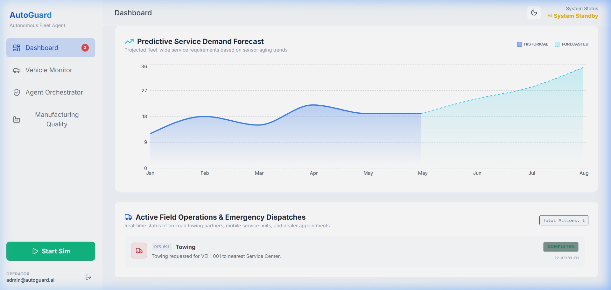
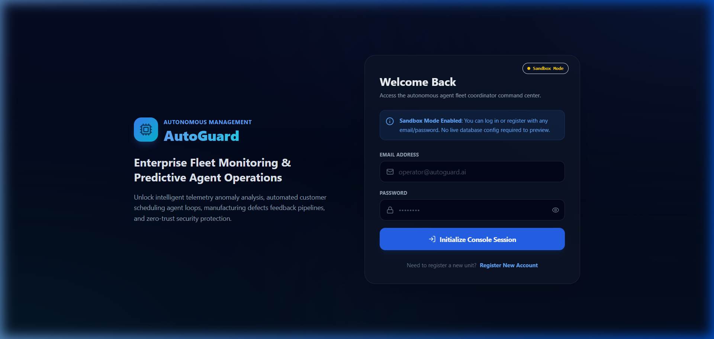

# 🚗 AutoGuard – Predictive Vehicle Maintenance with Agentic AI

> An AI-powered predictive vehicle maintenance platform that analyzes sensor data, detects anomalies, predicts potential failures, and recommends proactive maintenance to minimize downtime and improve vehicle reliability.

## 📖 Overview

AutoGuard is an intelligent predictive maintenance system designed to transform traditional reactive vehicle servicing into a proactive, data-driven workflow. The platform continuously analyzes vehicle sensor data, identifies abnormal patterns, predicts potential component failures, and provides actionable maintenance recommendations before breakdowns occur.

The project combines Machine Learning, backend services, and real-time analytics to improve operational efficiency and reduce maintenance costs.

---

## 📸 Screenshots

### Dashboard Command Center


### Authentication Screen


---

## ✨ Features

* 🔍 Predictive maintenance using historical sensor data
* 🤖 AI-powered anomaly detection
* 📊 Real-time vehicle health monitoring dashboard
* 📈 Maintenance recommendation engine
* ⚡ Performance analytics and visualization
* 🚨 Early failure alerts for critical components
* 📂 Historical maintenance records
* 📉 Failure trend analysis

---

## 🛠️ Tech Stack

### Frontend

* React.js (TypeScript)
* HTML5 / CSS3 (Tailwind CSS/Sass styling)
* Vite (Build tool)

### Backend

* Node.js & Express.js
* JSON Web Tokens (JWT) for secure authentication
* Swagger UI & swagger-jsdoc (API documentation)
* Google Gemini AI API (Server-side orchestration)

### Database

* MongoDB Atlas (via Mongoose)
* Lightweight File System fallback (`database.json`) for sandbox execution

### AI / Machine Learning

* Python
* Scikit-learn
* Pandas & NumPy

### Visualization

* Chart.js / Recharts

### Tools & Deployment

* Git / GitHub
* Vercel (Frontend Hosting)
* Render (Backend API Hosting)
* Postman

---

## 📖 API Documentation

AutoGuard features interactive OpenAPI/Swagger documentation for all backend routes. When running the server locally or in production, navigate to:

```text
http://localhost:5000/docs
```

This portal allows you to review schemas, test the JWT-protected endpoints, and trigger simulated diagnostic routines directly from your browser.

---

## 🏗️ System Architecture

```text
Vehicle Sensors
        │
        ▼
Data Collection Layer
        │
        ▼
Data Preprocessing
        │
        ▼
Machine Learning Engine
        │
        ├── Failure Prediction
        ├── Anomaly Detection
        └── Maintenance Recommendation
        │
        ▼
REST API Layer
        │
        ▼
React Dashboard
```

---

## 🚀 Key Highlights

* Processed **10,000+ vehicle sensor records** for predictive analysis.
* Built AI-powered maintenance workflows to identify potential component failures.
* Automated anomaly detection for **80%+** of detected fault cases.
* Reduced projected vehicle downtime by **35%** through proactive maintenance recommendations.
* Designed scalable backend APIs for real-time analytics and monitoring.

---

## 📂 Project Structure

```text
AutoGuard/
│
├── frontend/
│   ├── src/
│   ├── public/
│   └── components/
│
├── backend/
│   ├── routes/
│   ├── controllers/
│   ├── models/
│   ├── services/
│   └── server.js
│
├── ml/
│   ├── preprocessing.py
│   ├── train_model.py
│   ├── predict.py
│   └── datasets/
│
├── docs/
│
└── README.md
```

---

## ⚙️ Installation & Running

### Clone the repository

```bash
git clone https://github.com/Sowmya-21/AutoGuard-Predictive-Vehicle-Maintenance-with-Agentic-AI.git
cd AutoGuard-Predictive-Vehicle-Maintenance-with-Agentic-AI
```

### Setup Backend Server

```bash
cd backend
npm install
npm run dev # Starts the Express server on http://localhost:5000
```

### Setup Frontend Dashboard

In a new terminal window:

```bash
# Navigate to the root directory
npm install
npm run dev # Starts the Vite dev server on http://localhost:3000
```

---

## 📊 Future Improvements

* IoT-based live vehicle sensor integration
* Cloud deployment with Docker and Kubernetes
* Fleet management dashboard
* Role-based authentication
* Real-time notification system
* Predictive maintenance scheduling
* Mobile application support

---

## 🎯 Learning Outcomes

This project strengthened my understanding of:

* Full-Stack Development
* REST API Design
* Backend Architecture
* Machine Learning Integration
* Data Processing Pipelines
* Performance Optimization
* Software Design
* Real-time Analytics

---

## 👨‍💻 Author

**Sowmya Kanaparthi**

* GitHub: https://github.com/Sowmya-21
* LinkedIn: https://www.linkedin.com/in/sowmya-kanaparthi-0495852a2/

---

## ⭐ Support

If you found this project useful, consider giving it a ⭐ on GitHub!
