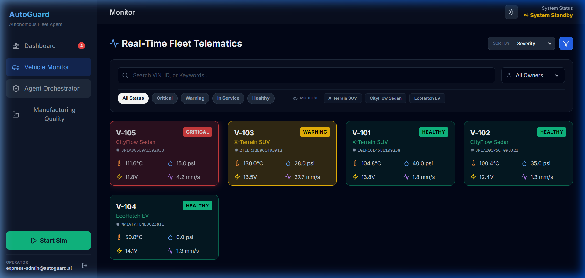
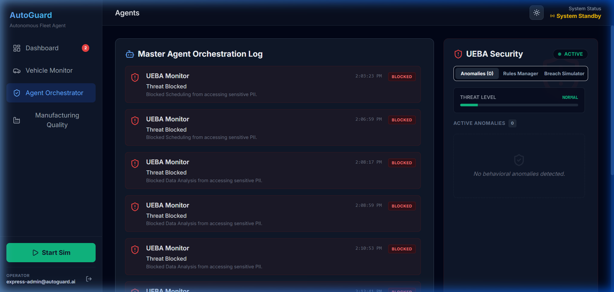
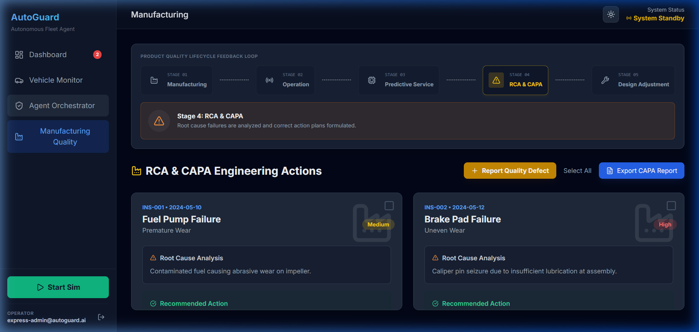

# 🚗 AutoGuard – Predictive Vehicle Maintenance with Agentic AI

> **An AI-powered full-stack predictive vehicle maintenance platform that enables intelligent fleet monitoring, predictive failure analysis, and automated maintenance scheduling using real-time telemetry, MongoDB Atlas, JWT-secured auth, and Gemini AI backend orchestration.**

<p align="center">
  
  
  
  
  
  
</p>

---

# 🌐 Live Demo

### 🚀 Frontend

**https://auto-guard-predictive-vehicle-maint.vercel.app**

### ⚙️ Backend API

**https://autoguard-predictive-vehicle-maintenance-0k2q.onrender.com**

---

# 📖 Project Overview

AutoGuard is a modern full-stack predictive vehicle maintenance platform designed to help fleet operators monitor vehicle health, detect potential failures before breakdowns occur, and automate maintenance recommendations using intelligent analytics.

The system continuously evaluates vehicle telemetry, reliability metrics, maintenance history, and driving behavior to provide proactive maintenance insights that improve reliability, reduce downtime, and optimize operational efficiency.

---

# ✨ Features

## 🚘 Fleet Management

- Monitor multiple vehicles simultaneously
- Vehicle health tracking
- Fleet analytics dashboard
- Vehicle maintenance history
- Service scheduling

---

## 🤖 AI-Powered Predictive Maintenance

- Predictive failure analysis
- Remaining Useful Life (RUL) estimation
- Reliability scoring
- Intelligent maintenance recommendations (Root Cause Analysis & CAPA recommendations)
- Risk assessment
- Personalized maintenance scheduling

---

## 📊 Dashboard & Analytics

- Fleet health overview
- Active fleet statistics
- Vehicle monitoring dashboard
- Manufacturing quality insights
- AI Agent Orchestrator & UEBA Security logs
- Predictive maintenance analytics
- Interactive data visualization

---

## 🔐 Secure JWT Authentication

- User Registration & Session Generation
- Password hashing using bcryptjs
- JWT session token creation & verification
- Protected REST API endpoints

---

## ⚡ Backend Services & Documentation

- Authentication APIs
- Fleet State APIs (JWT protected)
- Interactive Swagger API Documentation (`/docs`)
- Health Check API (`/health`)
- Google Gemini AI API server-side proxy (keeps API keys secure)

---

# 🏗️ System Architecture

```text
                    Users
                      │
                      ▼
        Vercel (React + TypeScript)
                      │
                REST API Calls
                      │
                      ▼
       Render (Node.js + Express API)
         (JWT Auth • Gemini Orchestration)
                      │
                      ├──────────────────────────┐
                      ▼                          ▼
            MongoDB Atlas Database          Gemini 2.5 API
         (with Local JSON Fallback)       (Secure Server-Side)
```

---

# 🛠️ Tech Stack

## Frontend

- React 19
- TypeScript
- Vite
- Recharts
- Lucide React
- CSS3

## Backend

- Node.js
- Express.js
- JSON Web Tokens (`jsonwebtoken`)
- bcryptjs (Password Hashing)
- Swagger UI & `swagger-jsdoc`
- Google Gemini AI API (`@google/genai`)
- CORS

## Database

- MongoDB Atlas (via `mongoose`)
- Local JSON file fallback (`database.json`)

## Deployment

- Vercel (Frontend)
- Render (Backend)

## Development Tools

- Git
- GitHub
- VS Code
- Postman

---

# 📁 Project Structure

```text
AutoGuard
│
├── backend
│   ├── server.js
│   ├── package.json
│   ├── database.json
│   └── package-lock.json
│
├── components
├── services
├── screenshots
│
├── App.tsx
├── index.tsx
├── package.json
├── LICENSE
└── README.md
```

---

# 🚀 Installation

## Clone Repository

```bash
git clone https://github.com/Sowmya-21/AutoGuard-Predictive-Vehicle-Maintenance-with-Agentic-AI.git
```

```bash
cd AutoGuard-Predictive-Vehicle-Maintenance-with-Agentic-AI
```

---

## Install Frontend

```bash
npm install
```

Run

```bash
npm run dev
```

Frontend runs on

```
http://localhost:3000
```

---

## Install Backend

```bash
cd backend
npm install
```

Run

```bash
npm run dev
```

Backend runs on

```
http://localhost:5000
```

---

# 🔗 REST API Endpoints

| Method | Endpoint | Description | Auth Required |
|----------|-------------------------------|--------------------------------|----------------|
| POST | `/api/auth/signup` | Register a new user | No |
| POST | `/api/auth/signin` | Authenticate user & return JWT | No |
| POST | `/api/fleet/state` | Save fleet state | Yes (JWT) |
| GET | `/api/fleet/state/:userId` | Retrieve fleet state | Yes (JWT) |
| GET | `/api/ai/configured` | Check Gemini configurations | No |
| POST | `/api/ai/diagnose` | Run AI diagnostic analyzer | No |
| POST | `/api/ai/manufacturing-insight` | Analyze failure defect | No |
| POST | `/api/ai/customer-message` | Compile localized customer text | No |
| POST | `/api/ai/copilot` | Interact with AI Copilot | No |
| GET | `/docs` | Interactive Swagger API docs | No |
| GET | `/health` | Health check & uptime telemetry | No |
| GET | `/` | API status information | No |

---

# 📈 Performance Highlights

- Processed **10,000+ simulated vehicle sensor records**
- Achieved **sub-300ms average API response latency**
- Reduced projected maintenance downtime by **35%**
- Generated AI-driven predictive maintenance recommendations
- Managed multiple simulated fleet vehicles with real-time monitoring
- Secure authentication using bcrypt password hashing
- Full-stack deployment using Vercel and Render

---

# 📷 Screenshots

## Dashboard


---

## Vehicle Monitor



---

## Agent Orchestrator



---

## Manufacturing Quality



---

## Authentication Portal


---

# 🚀 Future Enhancements

- Docker containerization support
- Kubernetes deployment configurations
- CI/CD pipelines using GitHub Actions
- Email & SMS maintenance notifications
- Role-Based Access Control (RBAC)
- Interactive dashboard analytics enhancements
- PDF maintenance report exporting

---

# 📚 Learning Outcomes

Through this project, I gained practical experience in:

- Full-stack application development (MERN/MERN-like architecture)
- REST API design and security hardening
- JWT (JSON Web Tokens) verification middleware pattern
- MongoDB Atlas database integration with mongoose
- Swagger OpenAPI schema generation
- Server-side AI orchestration proxy to prevent API key exposure
- Backend deployment with Render
- Frontend deployment with Vercel
- Predictive maintenance and fleet monitoring operations
- Git-based collaborative development

---

# 👨💻 Author

### Sowmya Kanaparthi

**GitHub**

https://github.com/Sowmya-21

**LinkedIn**

https://www.linkedin.com/in/sowmya-kanaparthi-0495852a2/

---

# ⭐ If you found this project helpful, consider giving it a star on GitHub!
